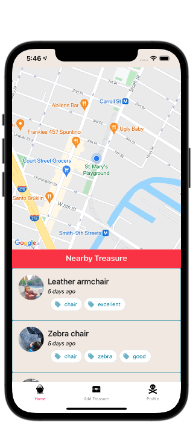
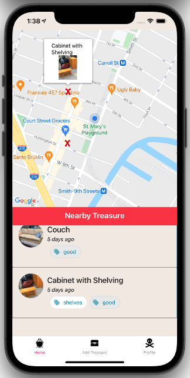
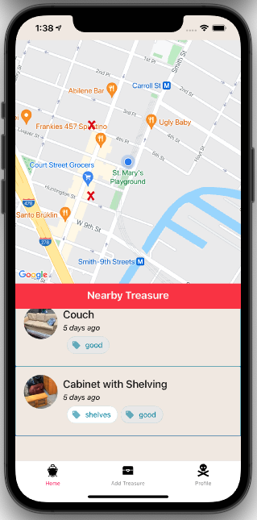
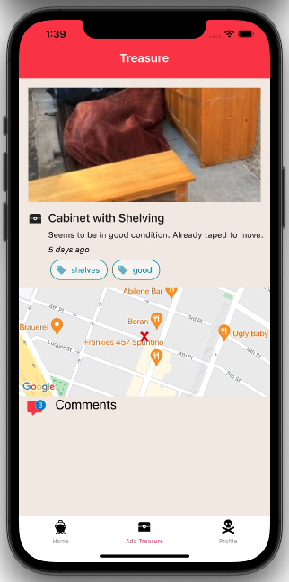
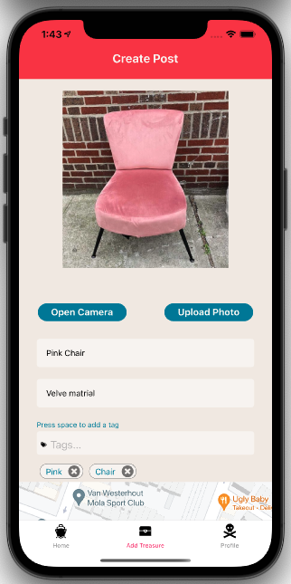
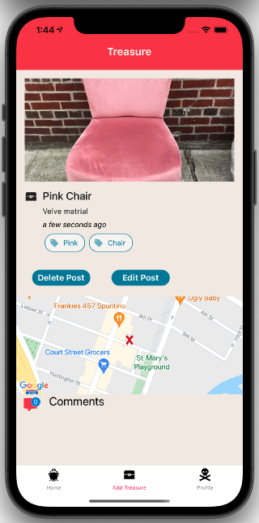
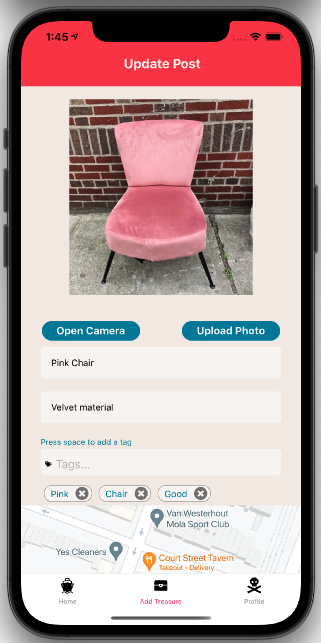
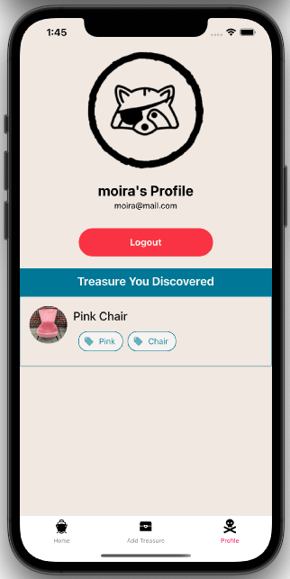

## TRASH PANDA

Turning trash into treasure by helping re-home curbed items.
Trash Panda leads you to discover curbed items near you. Trash Panda also helps you create posts to alert others of exciting street finds. One person's trash is another person's treasure.
Trash Panda is a single page application with the goal of keeping usable items out of landfills and redirecting them to new homes. Trash Panda was built with React Native, Google Maps API, Firebase, Redux, Node.js, Express, PostgreSQL, Expo, React Native Maps, Expo Geolocation, Sequelize, React Native Paper, and React Hooks. Creating a responsive map that updates based on map navigation proved to be an exciting challenge. While people use the app, it will automatically show finds in their vicinity. Similarly, when discovering an item, the app accesses your location to create posts on the go. Among our priorities, user experience was central to planning, designing, building and testing, resulting in a responsive, easy-to-use app. We are proud of the app we created and its tangible benefits.

## Tech Stack

Trash Panda was writtten in React Native powered by Expo-cli. Below is a list of other technologies used throughtout the project.

## Front End

- React Native
- React Hooks
- Redux
- GoogleMaps API
- React Native Paper

## Back End

- Firebase
- PostgreSQL
- Node.js
- Express
- Axios
<!--

## Viewing Published App

Note: testing this app requires downloading 'expo client' on an iOS product.

1. On your iOS device, download [expo client](https://apps.apple.com/us/app/expo-client/id982107779) from the app store.
2. Open the expo app and click on profile.
3. Sign in with the following credentials:
   • Username: **capacity**
   • Password: **capacity2020**
4. On the profile page under published projects, click on capacity
5. Sign up for a Capacity account or log in. You can now check on your favorite places and report on how crowded they are! -->

## Authors

[Allie Humphrey](https://github.com/allieh45 "Allie's Github") | [Anastasiia Kolendo](https://github.com/AnastasiaKolendo "Anastasiia's Github") | [Abi Scholz](https://github.com/abischolz "Abi's Github") | [Anna Strasser](https://github.com/albastrasser "Anna's Github")

## The App

